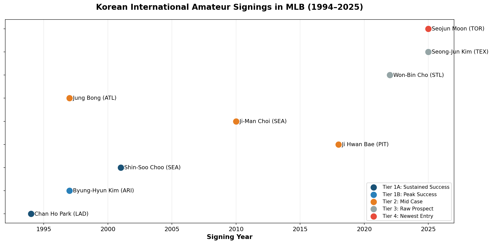
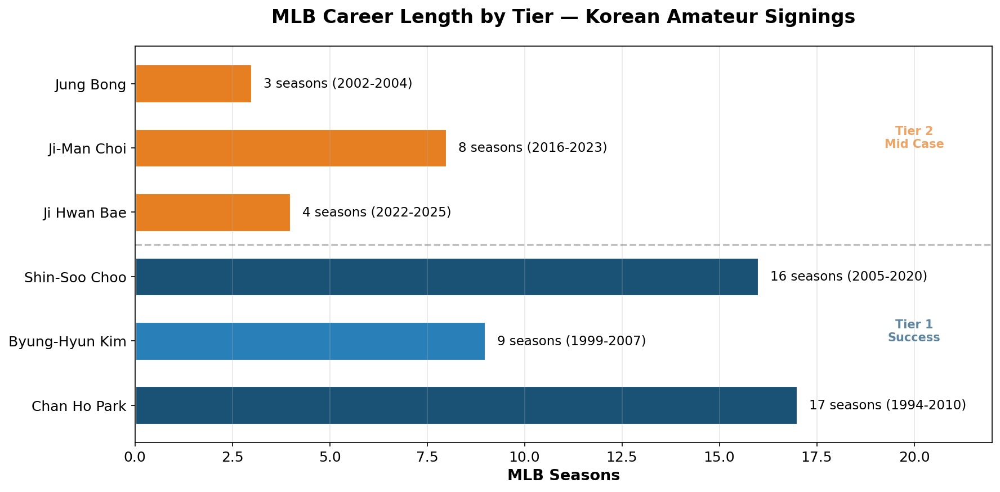
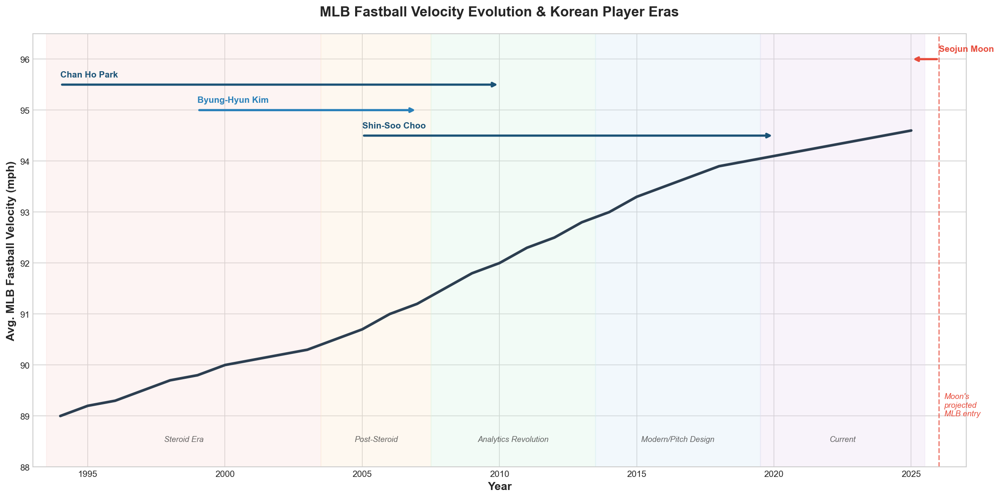
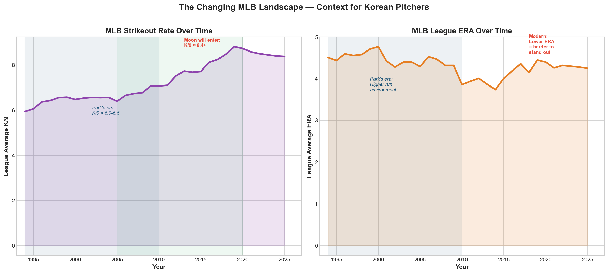
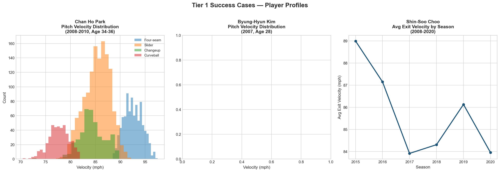
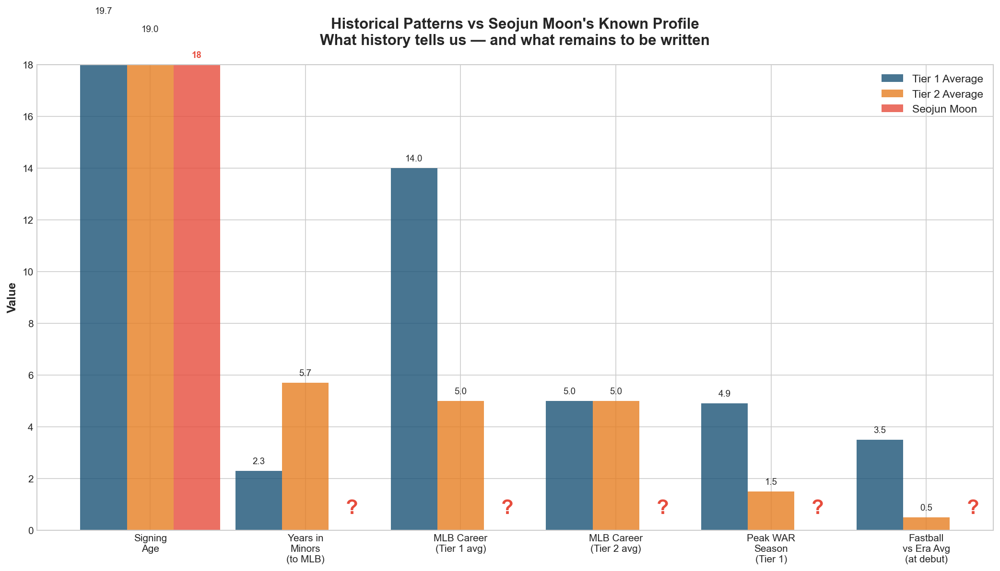

# Korean Players in MLB — A Pathway Analysis

A data-driven study of Korean players' development trajectories in Major League Baseball, segmented by outcome tier and analyzed within era-specific contexts. This work aims to inform development frameworks for the next generation of Korean amateur signings, with particular focus on the Toronto Blue Jays' first Korean-born international signing, **Seojun Moon**.

## Key Findings

### 1. The Signing Timeline — 30 Years of Korean Amateur Signings

Nine Korean players have entered MLB through international amateur signings since 1994. Three distinct waves emerge: the 1990s pioneers (Park, Kim, Bong), a second wave in the 2000s-2010s (Choo, Choi, Bae), and the current wave of prospects (Cho, Kim, Moon). The Toronto Blue Jays entered this market last, signing Seojun Moon in 2025.

### 2. Career Length Separates Tiers

Tier 1 success cases averaged 14+ MLB seasons, while Tier 2 mid cases averaged 3-5 seasons. The gap between sustained success and a short MLB career is defined not by raw talent, but by the ability to develop an elite, MLB-level differentiating skill.

### 3. The MLB Landscape Has Changed Dramatically

When Chan Ho Park debuted in 1994, the average MLB fastball was approximately 89 mph and his mid-90s velocity was elite. When Seojun Moon enters the league in 2026 or later, the average will exceed 94.5 mph — making his 90-95 mph range merely average. Success in the modern era requires elite secondary pitches, pitch design optimization, and the ability to evolve.

Strikeout rates have increased by over 40% since Park's era (K/9 of 6.0 vs 8.4 today). Generating swings and misses is now a baseline expectation, not a differentiator.

### 4. Tier 1 vs Tier 2 — What Separates Success from Survival

Each Tier 1 player possessed a unique, elite-level trait:
- **Park:** Elite velocity relative to his era
- **Kim:** Submarine delivery creating natural deception
- **Choo:** Elite plate discipline (career 14.5% walk rate)

Tier 2 players, while talented, could not develop a comparable MLB-level differentiator.

### 5. Implications for Seojun Moon

Moon's signing age (18) is consistent with Tier 1 averages. However, the question marks in his profile represent the central challenge: history provides patterns, but Moon's future remains to be written.

**Development priorities identified through this analysis:**

1. **Pitch design optimization** — In a 94.5 mph average era, Moon's 4-pitch mix (FB, SL, CB, CH) is his primary asset. Development should focus on making 2-3 of these plus pitches.
2. **Secondary pitch development** — His slider development will likely be the single most important factor in his MLB trajectory.
3. **Patient minor league path** — The historical average for successful Korean amateur signings is 2-3 years of minor league development. Rushing to MLB has historically been counterproductive.
4. **The Pioneer Effect** — As the Blue Jays' first Korean-born signing, Moon benefits from organizational commitment similar to what Park experienced with the Dodgers in 1994.

## Research Framework

This analysis examines nine Korean players organized into four tiers by outcome:

- **Tier 1 — Success Cases:** Park Chan-ho, Kim Byung-hyun, Choo Shin-soo
- **Tier 2 — Mid Cases:** Bae Ji-hwan, Choi Ji-man, Bong Joong-keun
- **Tier 3 — Raw Prospects:** Cho Won-bin (STL), Kim Seong-jun (TEX)
- **Tier 4 — Newest Entry:** Moon Seo-jun (TOR)

### Analytical Structure

1. **Pathway Segmentation** — Distinguishing KBO veterans from international amateur signings to avoid survivorship bias and common comparison errors
2. **Era-Adjusted Context** — Mapping each player's success factors against the MLB environment of their era (velocity trends, strikeout rates, roster construction)
3. **Forward Application** — Translating 30 years of historical patterns into contextual development implications for current prospects

## Methodology

- **Data sources:** MLB Statcast (via pybaseball), Baseball Reference, KBO records
- **Analysis tools:** Python (pandas, numpy), visualization via matplotlib
- **Dataset:** 48,000+ pitch-level and plate appearance records across 6 MLB players
- **Era-context framework:** Cross-referencing individual player performance against league-wide trends from 1994 to 2025

## Repository Structure

- `data/` — Player master list, Statcast CSV files for 5 players
- `notebooks/` — 6 Jupyter notebooks documenting the full analysis pipeline
- `visualizations/` — 10 publication-ready charts and figures

## Notebooks

| Notebook | Description |
|----------|-------------|
| `01_player_data_collection` | Statcast data acquisition for all players |
| `02_visualizations` | Signing timeline and career length charts |
| `03_era_adjusted_analysis` | MLB velocity and strikeout trend analysis |
| `04_tier1_analysis` | Detailed Tier 1 success factor breakdown |
| `05_tier2_analysis` | Tier 2 mid case comparison and failure analysis |
| `06_moon_synthesis` | Final synthesis connecting all findings to Moon |

## Author

**Seongji Park**
Statistics student at York University | Aspiring baseball analytics professional

- GitHub: [seongji-park](https://github.com/seongji-park)
- Email: sungji0826@gmail.com

## Acknowledgments

This analysis was conducted as an independent research project combining academic statistical training with a lifelong passion for baseball. All data is sourced from publicly available MLB Statcast records via the pybaseball Python library.# Korean Players in MLB — A Pathway Analysis

A data-driven study of Korean players' development trajectories in Major League Baseball, segmented by outcome tier and analyzed within era-specific contexts. This work aims to inform development frameworks for the next generation of Korean amateur signings, with particular focus on the Toronto Blue Jays' first Korean-born international signing, **Seojun Moon**.

## Key Findings

### 1. The Signing Timeline — 30 Years of Korean Amateur Signings

Nine Korean players have entered MLB through international amateur signings since 1994. Three distinct waves emerge: the 1990s pioneers (Park, Kim, Bong), a second wave in the 2000s-2010s (Choo, Choi, Bae), and the current wave of prospects (Cho, Kim, Moon). The Toronto Blue Jays entered this market last, signing Seojun Moon in 2025.

### 2. Career Length Separates Tiers

Tier 1 success cases averaged 14+ MLB seasons, while Tier 2 mid cases averaged 3-5 seasons. The gap between sustained success and a short MLB career is defined not by raw talent, but by the ability to develop an elite, MLB-level differentiating skill.

### 3. The MLB Landscape Has Changed Dramatically

When Chan Ho Park debuted in 1994, the average MLB fastball was approximately 89 mph and his mid-90s velocity was elite. When Seojun Moon enters the league in 2026 or later, the average will exceed 94.5 mph — making his 90-95 mph range merely average. Success in the modern era requires elite secondary pitches, pitch design optimization, and the ability to evolve.

Strikeout rates have increased by over 40% since Park's era (K/9 of 6.0 vs 8.4 today). Generating swings and misses is now a baseline expectation, not a differentiator.

### 4. Tier 1 vs Tier 2 — What Separates Success from Survival

Each Tier 1 player possessed a unique, elite-level trait:
- **Park:** Elite velocity relative to his era
- **Kim:** Submarine delivery creating natural deception
- **Choo:** Elite plate discipline (career 14.5% walk rate)

Tier 2 players, while talented, could not develop a comparable MLB-level differentiator.

### 5. Implications for Seojun Moon

Moon's signing age (18) is consistent with Tier 1 averages. However, the question marks in his profile represent the central challenge: history provides patterns, but Moon's future remains to be written.

**Development priorities identified through this analysis:**

1. **Pitch design optimization** — In a 94.5 mph average era, Moon's 4-pitch mix (FB, SL, CB, CH) is his primary asset. Development should focus on making 2-3 of these plus pitches.
2. **Secondary pitch development** — His slider development will likely be the single most important factor in his MLB trajectory.
3. **Patient minor league path** — The historical average for successful Korean amateur signings is 2-3 years of minor league development. Rushing to MLB has historically been counterproductive.
4. **The Pioneer Effect** — As the Blue Jays' first Korean-born signing, Moon benefits from organizational commitment similar to what Park experienced with the Dodgers in 1994.

## Research Framework

This analysis examines nine Korean players organized into four tiers by outcome:

- **Tier 1 — Success Cases:** Park Chan-ho, Kim Byung-hyun, Choo Shin-soo
- **Tier 2 — Mid Cases:** Bae Ji-hwan, Choi Ji-man, Bong Joong-keun
- **Tier 3 — Raw Prospects:** Cho Won-bin (STL), Kim Seong-jun (TEX)
- **Tier 4 — Newest Entry:** Moon Seo-jun (TOR)

### Analytical Structure

1. **Pathway Segmentation** — Distinguishing KBO veterans from international amateur signings to avoid survivorship bias and common comparison errors
2. **Era-Adjusted Context** — Mapping each player's success factors against the MLB environment of their era (velocity trends, strikeout rates, roster construction)
3. **Forward Application** — Translating 30 years of historical patterns into contextual development implications for current prospects

## Methodology

- **Data sources:** MLB Statcast (via pybaseball), Baseball Reference, KBO records
- **Analysis tools:** Python (pandas, numpy), visualization via matplotlib
- **Dataset:** 48,000+ pitch-level and plate appearance records across 6 MLB players
- **Era-context framework:** Cross-referencing individual player performance against league-wide trends from 1994 to 2025

## Repository Structure

- `data/` — Player master list, Statcast CSV files for 5 players
- `notebooks/` — 6 Jupyter notebooks documenting the full analysis pipeline
- `visualizations/` — 10 publication-ready charts and figures

## Notebooks

| Notebook | Description |
|----------|-------------|
| `01_player_data_collection` | Statcast data acquisition for all players |
| `02_visualizations` | Signing timeline and career length charts |
| `03_era_adjusted_analysis` | MLB velocity and strikeout trend analysis |
| `04_tier1_analysis` | Detailed Tier 1 success factor breakdown |
| `05_tier2_analysis` | Tier 2 mid case comparison and failure analysis |
| `06_moon_synthesis` | Final synthesis connecting all findings to Moon |

## Author

**Seongji Park**
Statistics student at York University | Aspiring baseball analytics professional

- GitHub: [seongji-park](https://github.com/seongji-park)
- Email: sungji0826@gmail.com

## Acknowledgments

This analysis was conducted as an independent research project combining academic statistical training with a lifelong passion for baseball. All data is sourced from publicly available MLB Statcast records via the pybaseball Python library.